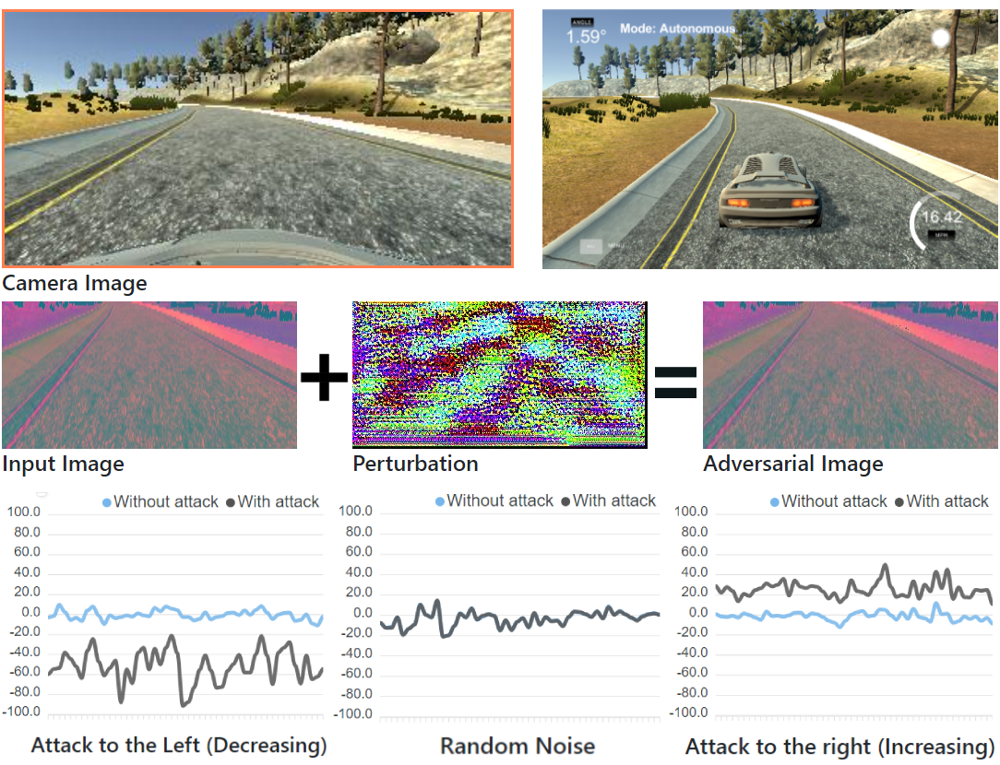

## Adversarial Driving

> Attacking End-to-End Autonomous Driving Systems

### Overview

**Adversarial Driving**: The behaviour of end-to-end autonomous driving model can be manipulated by adding unperceivable perturbations to the input image.




### Quick Start

####  1. Setup the  simulator

This simulator was built for Udacity's Self-Driving Car Nanodegree, and it's available [here](https://github.com/udacity/self-driving-car-sim).

If you use windows, please download **term1-simulator-windows.zip**, and open **beta_simulator.exe**.

####  2. Setup the server

You may use [anaconda](https://www.continuum.io/downloads) or [miniconda](https://conda.io/miniconda.html). 

```python
$ cd model
$ conda env create -f environment.yml
$ conda activate adversarial-driving
$ python drive.py model.h5
```

#### 3. Setup the browser

If you use windows, click on **client/client.exe** which is a golang web server. This server can be built with:

```
go get github.com/gobuffalo/packr
packr build
```

If you'd like to use your own web server, just serve all the content under **client/web**.


### Training the model

You can use the [dataset](https://d17h27t6h515a5.cloudfront.net/topher/2016/December/584f6edd_data/data.zip) from Udacity to train your own autonomous driving model. Extract the dataset to **model/data**, and the folder structure should be like this.

```
├───model
│   ├───data
│   │   ├───IMG
|   |   └───driving_log.csv
│   └───model.py
```

And then start training:

```python
python model.py
```

This will generate a file `model-<epoch>.h5` whenever the performance in the epoch is better than the previous best. More details are illustrated [here](https://github.com/udacity/CarND-Behavioral-Cloning-P3).


### Resources

- Dataset: https://d17h27t6h515a5.cloudfront.net/topher/2016/December/584f6edd_data/data.zip

- Simulator: https://github.com/udacity/self-driving-car-sim

- Project Structure: https://github.com/udacity/CarND-Behavioral-Cloning-P3

- Nvidia End-to-End model: https://developer.nvidia.com/blog/deep-learning-self-driving-cars/


